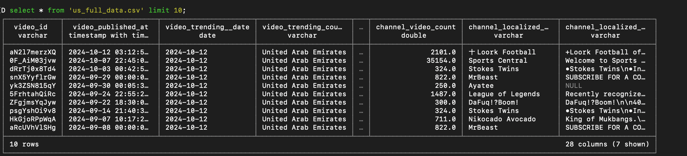

## 产品亮点
分析数据库
这是一个专门用于数据分析的SQL数据库管理系统，采用列式存储引擎设计，主要亮点是处理和同步本地 CSV ，支持标准的SQL查询语法。它最大的特点是进程内运行，不需要单独的服务器部署，可以直接嵌入到应用程序中使用。

数据处理快
在实际的数据分析场景中，无论是处理本地CSV文件还是远程Parquet数据，都能快速完成复杂的聚合查询。特别是处理大规模数据集时，其并行执行能力让查询速度提升明显，大大缩短了数据等待时间。

安装即用
整个系统的设计非常简洁，从安装到运行几乎不需要任何配置。支持多种编程语言接口，Python、R、Java都能直接调用，文档也很清晰，新手也能快速上手开始查询数据。

技术强大
基于MIT协议完全开源，支持扩展功能和自定义函数，可以读取S3等远程存储。虽然功能强大，但资源占用很小，单机就能处理超内存的数据 workload，真的很适合数据科学和日常分析。

<!--more-->甚至能直接同步到 postgresql：

预览文件：

导出部分文件：

## 价格模式
未明确说明

## 推荐理由
- 无需部署服务器，开箱即用

- 处理大数据集速度飞快

- 支持多种编程语言和文件格式

## 网站链接



